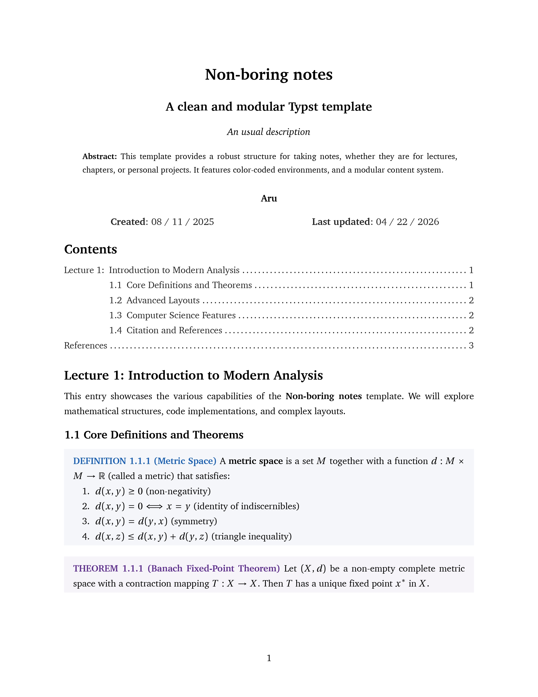

# Non-boring notes

A modular, colorful, and highly customizable Typst template for academic
documentation, lecture notes, and assignments. Designed to be simple to use
while providing professional-grade typesetting.



## Quick Start

### 1. Initialize Your Project

> [!IMPORTANT]
> Requires a Zsh environment and Typst installed.

First, clone this repository and, in the same location, execute the following
commands to make it available from anywhere:

```bash
chmod +x non_boring_notes.zsh
```

```bash
sudo ln -s "$(pwd)/non_boring_notes.zsh" /usr/local/bin/non-boring-notes
```

Now, you can create a new project directory instantly from any location:

```bash
non-boring-notes <your-project-name>
```

You'll be prompted to choose between:

- `Minimal`: A clean slate with just the essentials (title, subtitle, and body).
- `Full`: A comprehensive setup featuring a Table of Contents, author list,
  numbered headers, and example theorem environments.

Both styles are fully customizable to fit your specific workflow.

### 2. Live Preview

Navigate to your project directory and start the Typst compiler with watch mode:

```bash
cd <your-project-name>
typst watch main.typ
```

> [!TIP]
> If you use Neovim, I highly recommend the
> [Typst Preview](https://github.com/chomosuke/typst-preview.nvim) plugin for a
> seamless writing experience

---

## Configuration

Configure the `template` function in your `main.typ` to suit your needs. Here are
the most common parameters:

| Parameter | Type | Default | Description |
| :--- | :--- | :--- | :--- |
| `title` | `content` | `"Lecture Notes"` | Main title of the document. |
| `subtitle` | `content` | `none` | Optional subtitle. |
| `authors` | `array` | `()` | List of `(name: "", link: "")` dictionaries. |
| `accent` | `color` | `"#262626"` | Primary accent color for headers and links. |
| `text_lang` | `string` | `"en"` | Language: `"en"` (English) or `"es"` (Spanish). |
| `toc` | `bool` | `true` | Whether to show the Table of Contents. |
| `paper_size` | `string` | `"a4"` | e.g., `"a4"`, `"us-letter"`. |
| `cols` | `int` | `1` | Number of columns in the document. |

---

## Features

### Modular Content System

Organize your notes into logical units. The template encourages a structure
where `main.typ` includes files from `content/collections/`, which in turn
include files from `content/entries/`.

### Beautiful Environments

Includes pre-styled, color-coded blocks for various purposes. Use them as
`#theorem[...]`, `#definition[...]`, etc.

- **Logical Reasoning**: `theorem`, `lemma`, `corollary`, `proposition`, `hypothesis`
- **Fundamentals**: `definition`
- **Applied Practice**: `example`, `exercise`
- **Callouts & Notes**: `note`, `attention`, `important`, `tip`, `remark`
- **Formatting Utilities**: `proof`, `quote`, `indent`, `mathbox`, `horizontalrule`

### Multi-language Support

Switch between English and Spanish seamlessly. All environment labels
(e.g., "Theorem" vs. "Teorema") and document headers (e.g., "Contents" vs.
"Contenido") update automatically based on the `text_lang` parameter.

---

## Project Structure

The initialization script sets up a flat and organized workspace where styling
and localization are decoupled from your content:

```text
├── main.typ             # Primary entry point & configuration
├── lib.typ              # Core definitions
├── translated_terms.typ # Localization dictionary
├── .typst_main_file     # Internal marker for project identification
├── content/             # Your document's source text
│   ├── collections/     # High-level organization (e.g., Chapters, Weeks)
│   └── entries/         # Granular sections (e.g. Lectures)
├── bibliography/        # BibTeX .bib files 
└── assets/              # Images and external resources 
```
